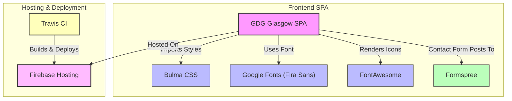

# Ecosystem & Integrations

Explore how the GDG Glasgow Landing Site seamlessly incorporates leading web services and tools like FontAwesome, Google Fonts, Bulma CSS, Formspree, Firebase, and Travis CI. This page reveals how each integration not only enhances the user experience for visitors but also streamlines development workflows for maintainers and contributors.

---

## Introduction

Creating a vibrant and engaging web presence for the GDG Glasgow community depends on reliable, efficient integrations with carefully selected third-party services. These integrations bring advanced styling, iconography, hosting, continuous deployment, and form handling capabilities without compromising performance or development agility.

By understanding these technologies and how they interconnect within the site, users and contributors alike gain insight into the product’s polished look-and-feel, responsive performance, and streamlined maintenance.

---

## Key Integrations and Their Impact

### FontAwesome: Iconography that Speaks Volumes

- **Purpose:** Provides a rich library of scalable vector icons used throughout the site’s navigation and UI points.
- **User Benefit:** Guests easily identify and navigate to social links (Facebook, Meetup) and interactive controls (contact form) via familiar, crisp icons.
- **Developer Flow:** The CSS link included in `index.html` loads FontAwesome efficiently with subresource integrity ensured for security.

### Google Fonts (Fira Sans): Elegant Typography

- **Purpose:** The site uses the 'Fira Sans' font family hosted by Google Fonts to ensure consistent, legible text across devices.
- **User Experience:** Ensures content readability and visual harmony, contributing to a modern, professional feel.
- **Customization:** Imported via CSS in `app.scss`, it works seamlessly with the Bulma framework.

### Bulma CSS Framework: Responsive, Modular Styling

- **Purpose:** Bulma CSS drives the site’s layout, components, and responsive design.
- **User Benefit:** Visitors enjoy a smooth experience on varied screen sizes, from desktops to mobile devices.
- **Developer Agility:** By importing Bulma in SCSS (`app.scss`), maintainers extend and customize styles easily without bloated CSS.

### Formspree: Hassle-Free Contact Forms

- **Purpose:** Handles form submissions from the Contact Us modal without requiring a backend server.
- **User Value:** Visitors send messages quickly and securely, enhancing engagement.
- **Technical Flow:** The contact form posts directly to Formspree’s service endpoint as configured in `index.html`.

### Firebase Hosting: Fast and Secure Delivery

- **Purpose:** Hosts the entire site with CDN-backed static hosting.
- **User Benefits:** Users experience fast load times and HTTPS security.
- **Developer Continuity:** Firebase’s config files (`firebase.json`, `.firebaserc`) define hosting rules, error handling, URL rewrites, and asset caching to optimize performance and reliability.

### Travis CI: Reliable Continuous Deployment

- **Purpose:** Automates testing and deployment workflows.
- **Developer Benefit:** When code is pushed to the `master` branch, Travis CI builds and publishes updated site versions automatically, minimizing manual overhead.
- **Integration Details:** Configuration in `.travis.yml` ensures Node.js environment setup, dependencies installation, production build execution, and secure Firebase deployment.

---

## How These Integrations Work Together

The GDG Glasgow Landing Site is a cohesive system where modern styling, secure hosting, interactive elements, and robust deployment work in concert:

- The **frontend SPA** uses Bulma for styling and Google Fonts for typography, making the UI clean, responsive, and consistent.
- Icons from **FontAwesome** provide visual clarity and ease of navigation.
- User interactions via the contact form are smoothly handled by **Formspree** without added backend complexity.
- The entire site is securely and efficiently hosted on **Firebase**, benefiting from CDN distribution and smart caching policies.
- Every change made to the source code is verified and propagated through **Travis CI**, ensuring continuous delivery and uptime.

This integration ecosystem guarantees a polished user experience, efficient community engagement, and maintainable site operations.

---

## Practical Tips for Contributors

- **When adding or updating styles**, ensure you import or extend Bulma via SCSS rather than adding large standalone CSS files to maintain consistency.
- **Use FontAwesome icons sparingly**, focusing on meaningful UI elements to keep the site visually clear and performant.
- **For contact form changes**, maintain the Formspree endpoint configuration to keep message delivery uninterrupted.
- **Firebase cache settings** in `firebase.json` are tuned for optimal performance. Avoid overriding these without strong justification.
- **CI/CD pipeline** relies on the `.travis.yml` setup. Test locally before pushing changes to avoid deployment failures.

---

## Common Pitfalls and Troubleshooting

<AccordionGroup title="Common Issues with Integrations">
<Accordion title="Form Submission Not Working">
Ensure the form’s `action` attribute points to the correct Formspree email address. Also, verify there is no ad blocker or browser extension blocking submission requests.
</Accordion>
<Accordion title="FontAwesome Icons Not Displaying">
Confirm the stylesheet link in `index.html` is loading properly without network errors. Check the integrity attribute and crossorigin settings.
</Accordion>
<Accordion title="Google Fonts Not Applying">
Check that the import URL in `app.scss` is reachable. Clear browser cache or try local builds to isolate CDN issues.
</Accordion>
<Accordion title="Site Not Deploying via Travis CI">
Look into Travis build logs for errors related to Node.js installation, build scripts, or Firebase token availability.
</Accordion>
</AccordionGroup>

---

## Summary Diagram

This diagram visually maps the relationships between the core integrations and the site components:

---

## Next Steps

- For developers: Review the [Setup & Installation](../getting-started/setup-and-installation/prerequisites) guide to prepare your environment for local development and deployment.
- For site contributors: Explore the [Feature Overview](../overview/architecture_features/feature_highlights) to understand user-facing capabilities.
- For troubleshooting help: See the [Troubleshooting Common Issues](../getting-started/initial-configuration-and-troubleshooting/troubleshooting-common-issues) page.

Explore the GitHub repository to view integration implementations and contribution workflow.

---

*This documentation ensures transparency about how GDG Glasgow’s landing page harnesses external tools to serve a superior user experience and facilitate smooth development cycles.*