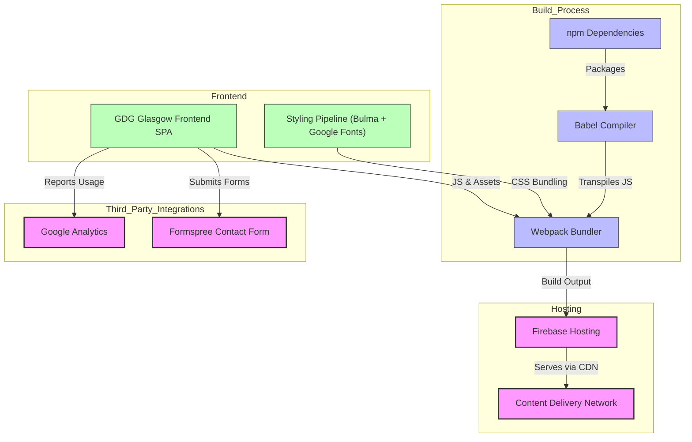

# System Architecture Overview

The **System Architecture Overview** provides a high-level visualization of how the GDG Glasgow Landing Site is structured and operates. This page focuses on illustrating the major flows and components that compose the site, including the frontend Single Page Application (SPA), the styling pipeline, static hosting infrastructure, and key third-party integrations for analytics and form handling.

---

## Introducing the Architecture

At its core, the GDG Glasgow Landing Site is a fully client-side rendered SPA that delivers a fast, responsive user experience. Behind this simplicity lies a streamlined architecture designed for performance, ease of maintenance, and extensibility.

This architecture empowers users to easily discover events, interact through contact forms, and navigate the site seamlessly with minimal latency.

---

## High-Level Architecture Components

The system consists of these major components:

- **Frontend SPA:** The heart of the user experience, built with modern JavaScript, delivering dynamic content without page reloads.
- **Styling Pipeline:** Utilizing Bulma CSS framework and Google Fonts, bundled via Webpack for maintainable, responsive styling.
- **Static Hosting:** The fully built site is deployed on Firebase Hosting, leveraging CDN and platform features for fast delivery and security.
- **Third-Party Integrations:** Google Analytics for visitor insights and Formspree handling contact form submissions without backend infrastructure.

This modular approach ensures that each part fulfills a clear role to deliver responsiveness, scalability, and ease of updates.

---

## Architecture Diagram

---

## Workflow Explanation

1. **Development and Build:**
   - Developers write JavaScript, SCSS, and HTML to create the SPA.
   - The styling pipeline leverages Bulma CSS and Google Fonts to ensure consistent and responsive design.
   - Using npm, the project dependencies are managed.
   - Babel compiles modern JavaScript to widely supported syntax.
   - Webpack bundles the JavaScript, styles, and assets into static files optimized for production.

2. **Deployment:**
   - After the build completes, the output goes through continuous deployment via Travis CI.
   - Travis CI runs the build and deploys the static bundle to Firebase Hosting.
   - Firebase serves the site through a global CDN ensuring fast load times worldwide.
   - Configuration in `firebase.json` sets caching strategies and security headers for optimal performance and protection.

3. **Runtime and Interaction:**
   - Users access the SPA through their browsers.
   - The SPA dynamically renders event content and shows interactive UI elements without full page reloads.
   - Form submissions from the contact modal are sent directly to Formspree, avoiding backend complexity.
   - Google Analytics captures user traffic data asynchronously for insights.

---

## Important Notes and Best Practices

- **Static Hosting Efficiency:** Leveraging a static hosting platform like Firebase allows the site to be highly scalable without managing servers.
- **Seamless SPA Experience:** Client-side routing and rendering create a smooth navigation experience essential for modern web apps.
- **Third-Party Integrations Simplify Backend Needs:** Using Formspree for forms offloads email handling without exposing backend services.
- **Security Headers:** Custom headers configured in `firebase.json` improve site security and prevent common web vulnerabilities.

---

## Troubleshooting Common Architecture Issues

<AccordionGroup title="Troubleshooting Architecture and Deployment">  <Accordion title="Build Failures in Travis CI">  Check the npm package versions and ensure all dependencies are installed correctly. Review the build logs for Babel or Webpack errors.  </Accordion>  <Accordion title="Firebase Deployment Errors">  Verify the correctness of the Firebase token and project configuration. Network issues or permission problems often cause deployment failures.  </Accordion>  <Accordion title="Contact Form Not Sending">  Confirm that the Formspree endpoint is correctly set in the form action attribute. Also, check for blocked scripts if a browser extension interferes.  </Accordion>  <Accordion title="Google Analytics Data Not Appearing">  Ensure the tracking ID configured in the SPA matches the Google Analytics property. Ad blockers might also prevent data collection during testing.  </Accordion></AccordionGroup>

---

## Next Steps

To deepen your understanding, consider exploring the following sections:

- [Feature Overview](/overview/architecture_features/feature_highlights) to see how architectural components translate into user-facing features.
- [Ecosystem & Integrations](/overview/architecture_features/ecosystem_integrations) for details on external services the site interacts with.
- [Setup and Installation](/getting-started/setup-and-installation/prerequisites) for environment requirements needed to build and run the site locally.

Together, these will enrich your grasp of the GDG Glasgow Landing Site's design and practical operation.

---

## References

- Configuration files impacting architecture:
  - `.travis.yml` manages build and deployment automation.
  - `firebase.json` configures hosting behavior and security.
  - `src/index.html` includes integration scripts for analytics and form handling.
- For source code and continuous updates, review the [GitHub repository](https://github.com/GDG-Glasgow/gdg-glasgow.com).

---

This system architecture overview grounds you in how all moving parts come together to deliver a performant, user-focused web experience for the GDG Glasgow community.